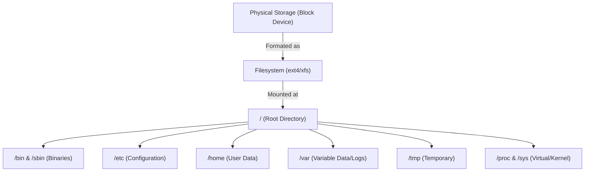
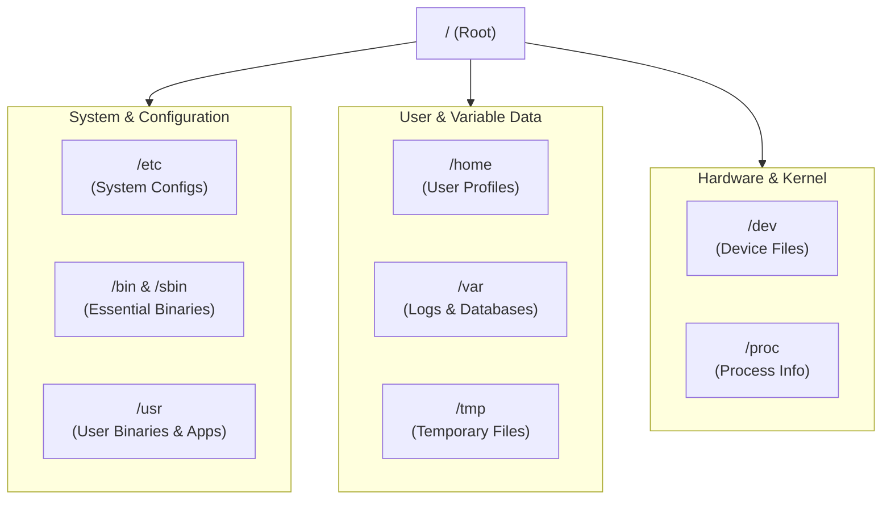
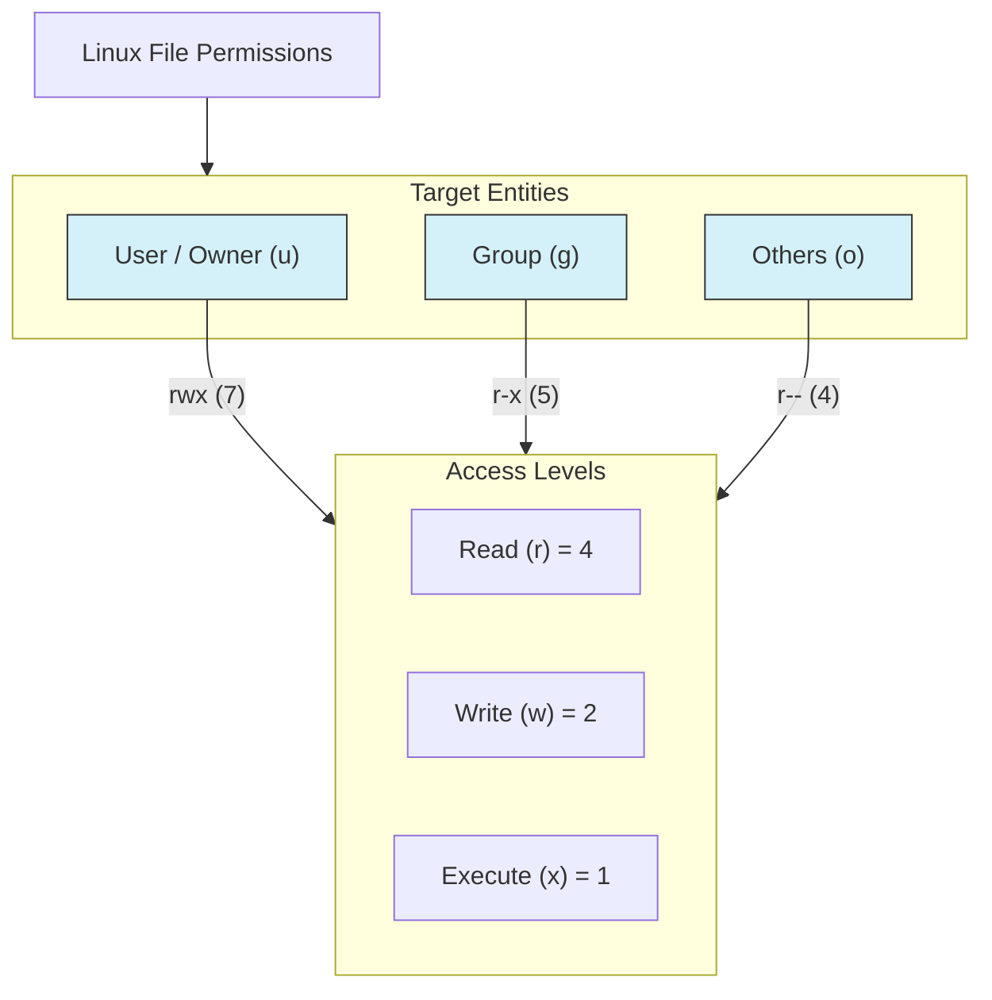

# Filesystem Basics: Essential Linux Guide

> **Linux Filesystem is the foundation of everything** — servers, containers, cloud VMs, CI/CD runners, and production workloads.
> If you understand the filesystem well, **half of Linux is already mastered**.

---

## 1. What is a Filesystem?

A **Filesystem** is the operating system’s method of **organizing, storing, and retrieving data** on a storage device.
For DevOps and Cloud engineers, filesystem knowledge is critical for **debugging issues, securing systems, managing logs, and automating deployments**.

### Core Responsibilities of a Filesystem

* **Structure** → Converts raw disk blocks into a human-readable directory tree
* **Metadata** → Stores information *about* files (size, owner, timestamps, permissions)
* **Access Control** → Enforces security (who can read, write, execute)

### Filesystem Conceptual View





## 2. Linux Directory Hierarchy (FHS – Filesystem Hierarchy Standard)

Linux follows a **standard directory layout**, making systems predictable and automation-friendly.

### Core Directory Reference

| Path    | Purpose                                        |
| ------- | ---------------------------------------------- |
| `/`     | **Root** – Starting point of the entire system |
| `/bin`  | Essential user binaries (ls, cp, mv)           |
| `/etc`  | System-wide configuration files                |
| `/home` | User home directories                          |
| `/root` | Home directory of root (admin) user            |
| `/tmp`  | Temporary files (cleared on reboot)            |
| `/usr`  | User-installed applications and libraries      |
| `/var`  | Variable data (logs, cache, spool files)       |
| `/dev`  | Device files (disks, terminals)                |

### Directory Relationship View




## 3. Essential Filesystem Commands

### Navigation & Inspection

```bash
pwd                 # Show current directory
cd /path            # Change directory
ls -la              # List files with permissions & ownership
stat file.txt       # View detailed file metadata
```

### Search & Discovery

```bash
find /etc -name "*.conf"   # Search files by name
```

### Permissions & Ownership

```bash
chmod 755 script.sh        # Change file permissions
chown user:group file.txt # Change owner and group
```

### Permission Model (How chmod Works)





## 4. Hands-On Lab: Permissions & Execution

###  Objective

Understand **why execution fails** and **how Linux enforces permissions**.

### Task Steps

1. Create a script
2. Try executing without permission
3. Fix permissions and run again

---

### Step 1: Create the Script

```bash
echo 'echo "Hello, Linux!"' > hello.sh
```

---

### Step 2: Try to Execute (Failure Expected)

```bash
./hello.sh
```

**Output:**

```text
bash: ./hello.sh: Permission denied
```

> Linux blocks execution because **execute permission is missing**.


### Step 3: Grant Execute Permission

```bash
chmod u+x hello.sh
./hello.sh
```

**Output:**

```text
Hello, Linux!
```


## 5. Challenges (Practice Like an Engineer)

### Medium: File Investigation

**Task:**

* Identify your current directory
* Locate the `ls` binary

<details>
<summary>View Solution</summary>

```bash
pwd
which ls
```

</details>


###  Hard: Advanced Search & Redirection

**Task:**
Find all `.conf` files under `/etc` and save the list to your home directory.

<details>
<summary>View Solution</summary>

```bash
find /etc -name "*.conf" > ~/config_list.txt
```

</details>


## 6. Why Filesystems Matter in DevOps

Filesystem mastery directly impacts **real-world DevOps work**:

* Debug container and VM filesystem issues
* Manage application and system configuration safely
* Secure production servers with correct permissions
* Handle logs, backups, and disk usage confidently
* Automate tasks using scripts without breaking systems

> **Strong filesystem fundamentals = faster debugging + safer automation + confident engineering**
