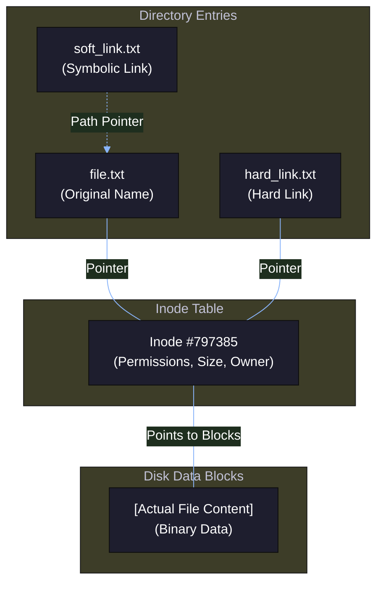
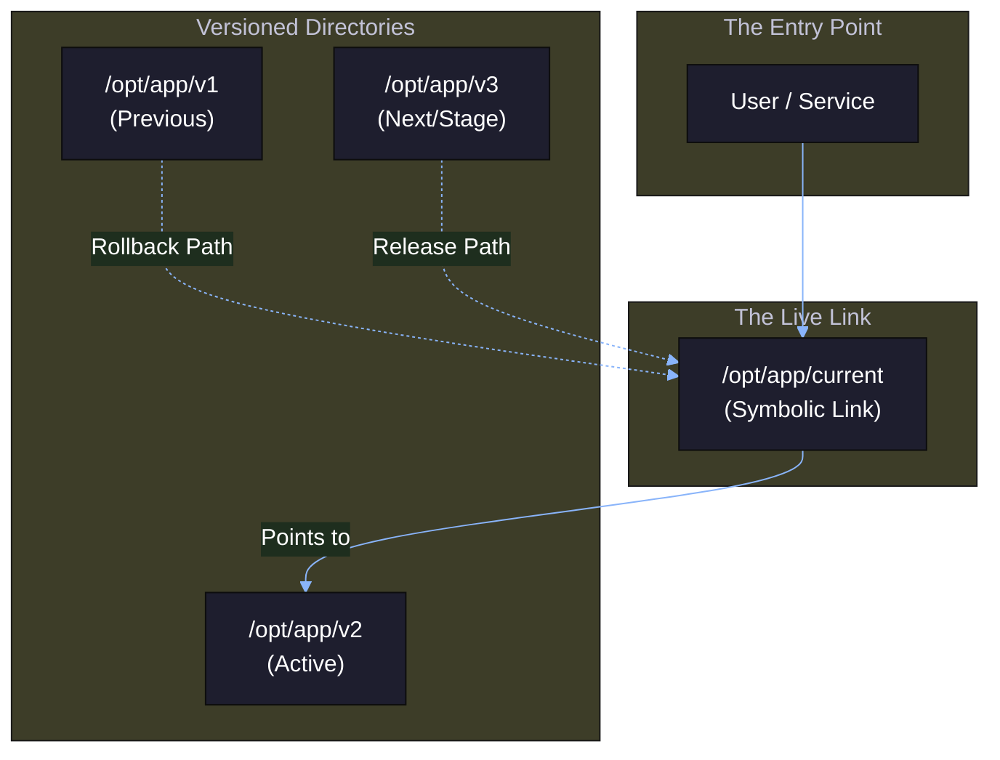
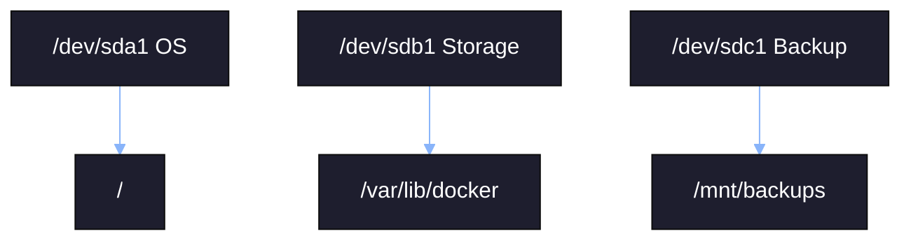
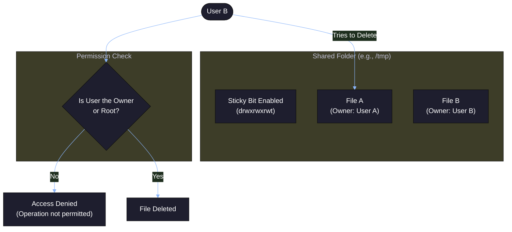
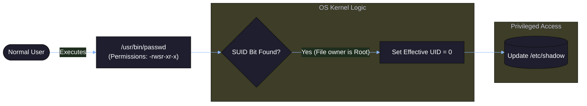

## Inodes and Symbolic Links

In Linux, everything is treated like a file.

The system does not track files by name. It tracks them using an internal ID called an inode. The filename is just a label pointing to that inode.

* The Inode: The unique "passport" of a file that stores metadata like permissions and ownership.

* Hard Links: Mirror copies that point directly to the same data on the disk.

* Soft Links: Shortcuts that point to a filename, allowing for flexible paths across different storage devices.



## 1. Inode

An **inode** is the internal data structure that stores:

* File size
* Owner and group
* Permissions
* Timestamps
* Disk block locations

It does **not** store the filename. Filenames are directory entries that point to an inode number.

Check inode number:

```bash
ls -i file.txt
```

Two files with the same inode number are the same underlying data.

Example:

```bash
echo "release-1" > app.log
ln app.log app_copy.log
ls -i app.log app_copy.log
```

Both files show the same inode number. Deleting one does not remove the data until all links are removed.

---

## 2. Hard Link

A hard link is an additional filename pointing to the same inode.

```bash
ln source.txt hardlink.txt
```

Use case: maintaining multiple references to the same binary or data file without duplicating storage.

Properties:

* Shares same inode
* Cannot span filesystems
* Data removed only when last link is deleted

---

## 3. Soft Link (Symbolic Link)

A symbolic link is a special file that stores the path to another file.

```bash
ln -s /opt/app/v1/app /usr/local/bin/app
```

Use case: version switching.

Directory layout:

```
/opt/app/
 ├── v1/
 ├── v2/
 └── current -> v2
```

Deployment model:



Changing version:

```bash
ln -sfn /opt/app/v3 /opt/app/current
```

If the original target is deleted, the symlink becomes broken.

---

### Inode Exhaustion Scenario

Symptom:

```
No space left on device
```

But:

```bash
df -h
```

shows free space.

Check inode usage:

```bash
df -i
```

High IUse% indicates too many small files.

Common cause:

* Log directories
* Cache directories
* Temporary upload folders

Find directories with excessive small files:

```bash
find /data -xdev -type f | wc -l
```

---
## Mount Points and Disk Attachment

Linux attaches block devices to the directory tree using mount points.

Example:



Explanation:

* `/dev/sda1` → operating system
* `/dev/sdb1` → Docker data
* `/dev/sdc1` → backup storage

Check mounted filesystems:

```bash
lsblk
mount
df -h
```

Attach a disk:

```bash
mount /dev/sdb1 /data
```

Persistent mount entry in `/etc/fstab`:

```
UUID=xxxx-xxxx /data ext4 defaults 0 2
```

Operational risk:

If `/var/lib/docker` fills up, containers fail even if root (`/`) has space.

---

## Special Permission Modes

### Sticky Bit (`+t`)

Common on shared directories like `/tmp`.

```bash
chmod +t /shared
```

Effect:

Only the file owner can delete their own files inside that directory.

Example:



Even with write permission, UserB cannot delete FileA.

---

### SUID (`+s`)

Runs executable with owner’s privileges.

Example:

```bash
ls -l /usr/bin/passwd
```

You may see:

```
-rwsr-xr-x
```

The `s` in owner position indicates SUID.

Execution flow:



The program executes with root privileges even when triggered by a normal user.

---

## Troubleshooting Challenge: The Inode Trap

Condition:

* `df -h` → 20% used
* Cannot create new file

Resolution:

```bash
df -i
```

If inode usage is 100%, storage blocks are free but no inode structures remain.

Remediation pattern:

* Remove unnecessary small files
* Rotate logs
* Increase filesystem inode density (requires reformat)

This condition is common in logging systems, container environments, and temporary upload services.
