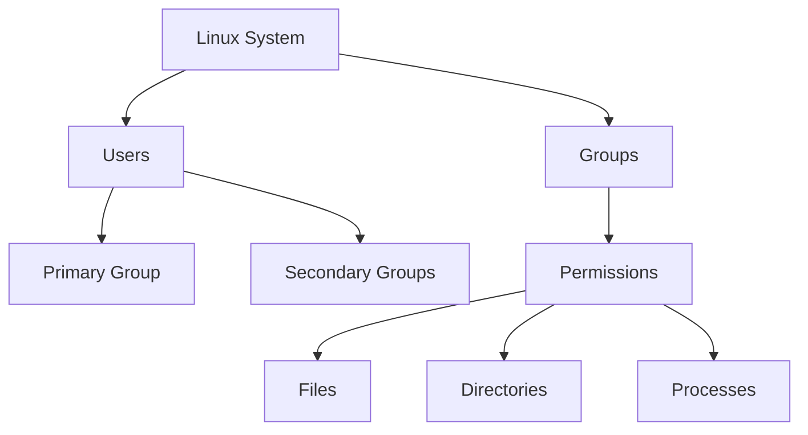

# User and Group Management (Linux for DevOps)

## 1. Introduction

**User and Group Management** in Linux is the foundation of **system security, access control, and compliance**.

In DevOps environments, proper user and group management ensures:

* Secure server access
* Least-privilege enforcement
* Safe CI/CD execution
* Audit-ready infrastructure

Linux manages access using:

* **Users** → individual identities
* **Groups** → logical collections of users
* **Permissions** → control over files, processes, and services


## 2. Core Concepts

###  Users

* Represent individuals or services
* Each user has a **UID**
* Stored in `/etc/passwd`

### Groups

* Collection of users
* Used to simplify permission management
* Stored in `/etc/group`

### System vs Normal Users

| Type         | UID Range | Purpose                  |
| ------------ | --------- | ------------------------ |
| System Users | 0–999     | Services (nginx, docker) |
| Normal Users | 1000+     | Human users              |


## 3. User–Group Relationship (Mermaid Diagram)




## 4. Key Commands (Essential)

```bash
# Create a user
useradd devuser

# Set password
passwd devuser

# Create a group
groupadd devops

# Add user to group
usermod -aG devops devuser

# Verify user and group details
id devuser
```


## 5. Important Files to Know

| File           | Purpose              |
| -------------- | -------------------- |
| `/etc/passwd`  | User account details |
| `/etc/shadow`  | Encrypted passwords  |
| `/etc/group`   | Group information    |
| `/etc/sudoers` | Sudo permissions     |


## 6. Ready-to-Use Practice Scripts

### Script: Create User Safely

```bash
#!/bin/bash

USERNAME=testuser

if id "$USERNAME" &>/dev/null; then
    echo "User already exists"
else
    useradd "$USERNAME"
    passwd "$USERNAME"
    echo "User $USERNAME created successfully"
fi
```

---

### Script: Add User to DevOps Group

```bash
#!/bin/bash

usermod -aG devops testuser
echo "testuser added to devops group"
```

---

## 7. Hands-on Session (Lab Tasks)

### Lab 1: User Creation

* Create `appuser`
* Set password
* Verify UID and groups

### Lab 2: Group Management

* Create `ci-cd` group
* Add multiple users
* Verify group membership

### Lab 3: Sudo Access

```bash
usermod -aG sudo appuser
```

* Test sudo access
* Validate permissions

---

## 8. Common Mistakes (Production)

* Giving sudo to all users
* Running services as root
* Editing `/etc/passwd` manually
* Not using groups for access control

---

## 9. How This Helps in DevOps

### CI/CD Pipelines

* Dedicated users for Jenkins, GitLab Runner
* Prevents pipeline misuse

### Server Security

* Role-based access using groups
* Auditable permissions

### Kubernetes & Containers

* Non-root containers
* Mapping Linux users to pods


## 10. Interview Questions (DevOps)

1. Difference between user and group?
2. What is primary vs secondary group?
3. How does sudo work internally?
4. Why should services not run as root?
5. Where are Linux users stored?


## 11. Real-World Scenario

**Problem:**
Deployment fails after new user creation.

**Root Cause:**
User not added to required group.

**Fix:**

```bash
usermod -aG docker deployuser
```
