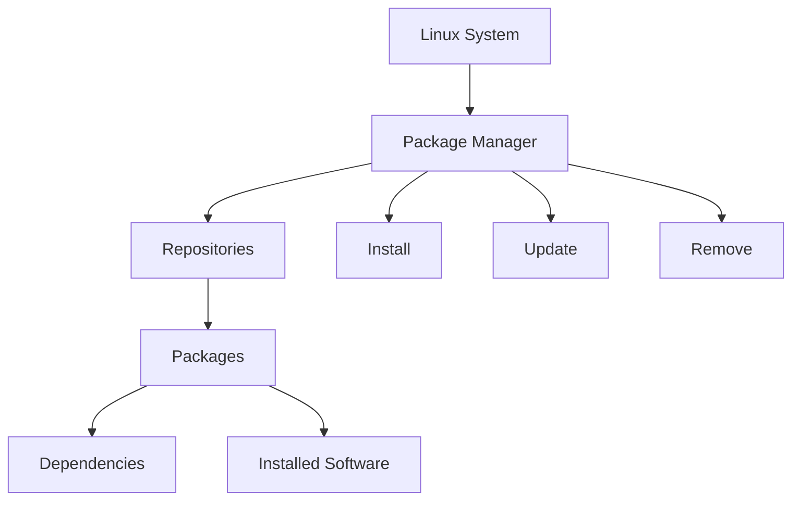

# Package Management (Linux for DevOps)

## 1. Introduction

**Package Management** in Linux is the process of **installing, upgrading, configuring, and removing software** in a controlled and reliable way.

In DevOps environments, package management is critical for:

* Consistent server provisioning
* Automation using scripts and configuration management
* Building Docker images
* Ensuring security updates are applied

A package manager handles:

* Dependencies
* Version control
* Repository management


## 2. Package Management Architecture (Mermaid Diagram)




## 3. Common Package Managers

| OS Family           | Package Manager | Command   |
| ------------------- | --------------- | --------- |
| Debian / Ubuntu     | APT             | apt       |
| RHEL / CentOS       | YUM / DNF       | yum / dnf |
| Alpine (Containers) | APK             | apk       |


## 4. Key Commands (APT – Ubuntu/Debian)
```bash
# Update package index
apt update

# Install a package
apt install nginx -y

# Remove a package (binary only)
apt remove nginx

# Remove unused dependencies
apt autoremove
```


## 5. Important Concepts (Must Know) 

### Repository

* A remote location that stores packages
* Defined in `/etc/apt/sources.list`

### Package Index

* Local cache of available packages
* Updated using `apt update`

### Dependency Resolution

* Automatically installs required libraries
* Prevents application breakage


## 6. Ready-to-Use Practice Scripts

### Script: Safe Package Installation

```bash
#!/bin/bash

PACKAGE=curl

apt update

if dpkg -l | grep -q "$PACKAGE"; then
    echo "$PACKAGE already installed"
else
    apt install "$PACKAGE" -y
    echo "$PACKAGE installed successfully"
fi
```


### Script: Clean Unused Packages

```bash
#!/bin/bash

apt autoremove -y
apt autoclean
echo "Unused packages cleaned"
```


## 7. Hands-on Session (Lab Tasks)

### Lab 1: Package Lifecycle

* Install `nginx`
* Verify installation
* Remove `nginx`
* Clean dependencies

```bash
apt install nginx -y
systemctl status nginx
apt remove nginx
apt autoremove
```


### Lab 2: Identify Installed Packages

```bash
dpkg -l | less
```

Tasks:

* Identify large packages
* Find unused software


## 8. Common Issues & Troubleshooting

### Issue: Package not found

**Cause:** Repository not updated
**Fix:**

```bash
apt update
```

### Issue: Dependency errors

**Fix:**

```bash
apt --fix-broken install
```

## 9. How This Helps in DevOps

### Server Provisioning

* Automated installs via scripts
* Used in cloud-init and Ansible

### Docker Image Builds

* Install only required packages
* Reduce image size

### CI/CD Pipelines

* Consistent build environments
* Reproducible deployments

## 10. DevOps Interview Questions

1. Difference between `apt update` and `apt upgrade`?
2. What is a repository?
3. How does dependency resolution work?
4. Why is `apt autoremove` important?
5. Why is Alpine Linux preferred in containers?

## 11. Real-World Scenario

**Problem:**
Server disk fills up frequently.

**Root Cause:**
Unused packages and cached files.

**Solution:**

```bash
apt autoremove
apt autoclean
```
