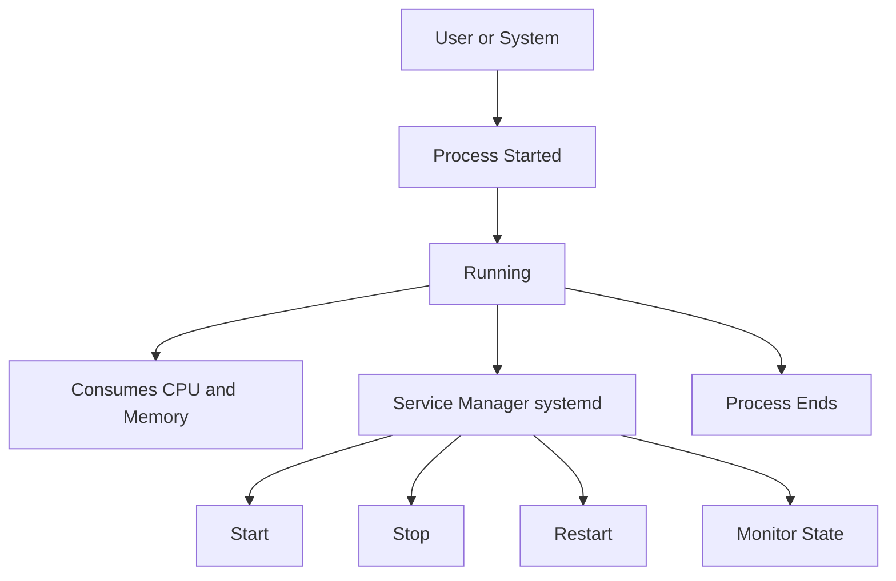
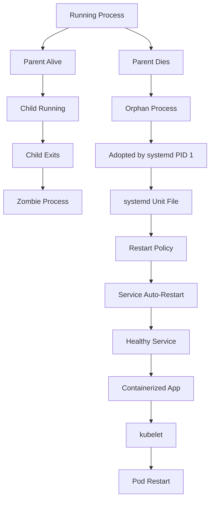

# Process and Service Management (Linux for DevOps)

## 1. Introduction

In Linux, **processes** and **services** represent running programs that consume system resources such as CPU, memory, disk, and network.

For DevOps engineers, understanding process and service management is critical for:

* Diagnosing production issues.
* Ensuring high availability.
* Managing application lifecycles.
* Automating recovery and self-healing.

Linux primarily uses **systemd** to manage long-running services.

## 2. Core Concepts

### Process

* A running instance of a program
* Identified by a **PID**
* Can be foreground or background

### Service

* A long-running background process
* Managed by **systemd**
* Automatically starts, stops, and restarts


## 3. Process & Service Lifecycle (Mermaid Diagram)



## 4. Key Commands (Daily Use)

### Process Monitoring

```bash
ps aux
top
```

### Service Management (systemd)

```bash
systemctl status nginx
systemctl restart nginx
systemctl stop nginx
systemctl start nginx
```

### Process Termination

```bash
kill PID
kill -9 PID
```

## 5. Hands-on Session (First Exposure)

### Lab 1: Process Monitoring

```bash
top
ps aux --sort=-%cpu | head
```

Tasks:

* Identify CPU-heavy processes
* Identify memory-heavy processes


### Lab 2: Service Failure Simulation

```bash
systemctl stop nginx
systemctl status nginx
systemctl restart nginx
```

## 6. Important systemd Concepts

| Concept | Description                      |
| ------- | -------------------------------- |
| Unit    | Configuration file for a service |
| Target  | Group of services                |
| Journal | Centralized logging              |
| Daemon  | Background service               |

## 7. Ready-to-Use Practice Scripts

### Restart a Critical Service Safely

```bash
#!/bin/bash
SERVICE=ssh

systemctl is-active --quiet $SERVICE
if [ $? -eq 0 ]; then
    systemctl restart $SERVICE
    echo "$SERVICE restarted successfully"
else
    echo "$SERVICE is not running"
fi
```

### Find High Memory Processes

```bash
#!/bin/bash
ps aux --sort=-%mem | head -10
```

## 8. Zombie & Orphan Processes (Linux Internals)

### Definitions

* **Zombie Process** – Finished execution but still in process table
* **Orphan Process** – Parent terminated, child still running

### Identify Zombie Processes

```bash
ps aux | awk '$8 ~ /Z/ {print $2, $11}'
```

### Fix Zombie Processes

> Zombies cannot be killed directly
> Fix = restart parent process

```bash
ps -eo pid,ppid,state,cmd | grep Z
kill -9 PPID
```

### Identify Orphan Processes

```bash
ps -eo pid,ppid,cmd | awk '$2 == 1'
```

> PPID = 1 → adopted by `systemd`


## 9. systemd Unit File (Service Definition)

### Location

```bash
/etc/systemd/system/
```

### Basic Unit File Structure

```ini
[Unit]
Description=My App Service
After=network.target

[Service]
ExecStart=/usr/bin/python3 /opt/app/app.py
Restart=always
User=appuser

[Install]
WantedBy=multi-user.target
```

### Reload & Start

```bash
systemctl daemon-reload
systemctl start myapp
systemctl enable myapp
```

## 10. Auto-Restart & Self-Healing (Node Level)

### Enable Auto-Restart

```ini
Restart=always
RestartSec=5
```

### Check Restart Behavior

```bash
systemctl status myapp
```

### Simulate Failure

```bash
kill -9 $(pidof myapp)
```

> systemd **automatically restarts the service**

## 11. Self-Healing Demo (Hands-on)

```bash
systemctl start nginx
kill -9 $(pidof nginx)
systemctl status nginx
```


## 12. From Linux Self-Healing → Kubernetes Self-Healing

### Concept Mapping

| Linux           | Kubernetes           |
| --------------- | -------------------- |
| Process         | Container            |
| systemd         | kubelet              |
| Service restart | Pod restart          |
| kill -9         | Container crash      |
| Restart=always  | restartPolicy=Always |

### Pod Restart Example

```yaml
restartPolicy: Always
```

### What Happens Internally

```text
Process crash
→ Container exits
→ kubelet detects failure
→ Pod restarts
```


## 13. Zombie, Orphan & Self-Healing Flow (Mermaid Diagram)



## 14. Common Mistakes in Production

* Overusing `kill -9`
* Restarting without checking logs
* Running services as root
* Missing auto-restart policies


## 15. Real-World Scenario

**Problem:** Application unresponsive
**Diagnosis:** High CPU usage

```bash
ps aux --sort=-%cpu
kill PID
systemctl restart application
```

---

## 16. How This Helps in DevOps

* Faster outage recovery
* Safer production operations
* Strong foundation for Kubernetes troubleshooting

---

## 17. DevOps One-Line Summary

* **systemd** → node-level self-healing
* **Kubernetes** → cluster-level self-healing
* Same principle, different scale

---

## 18. Interview Rapid-Fire Commands

```bash
ps aux | grep Z
systemctl status
journalctl -u nginx
kill -9 PID
systemctl daemon-reload
```
