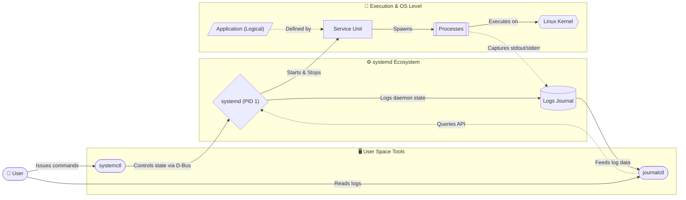
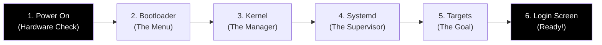
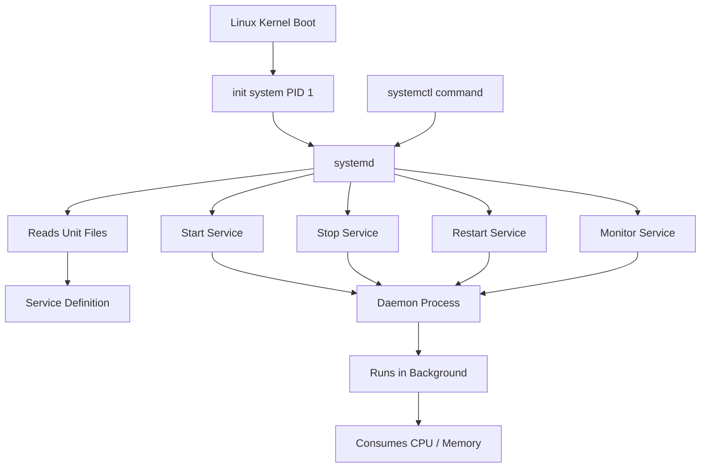
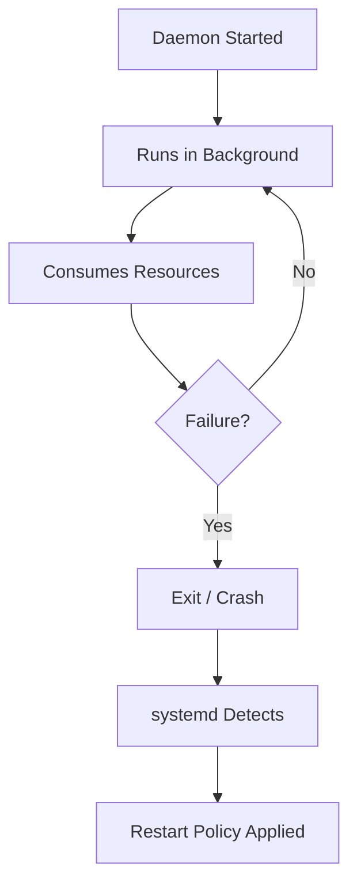
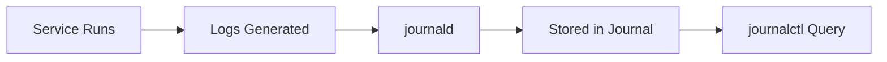
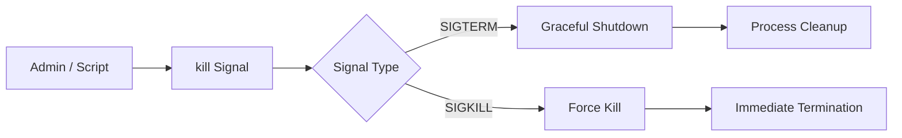
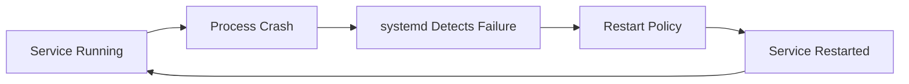

# Process and Service Management in Linux

## 1. Introduction: 

* **Application**
Logical software unit defined by purpose. May consist of multiple processes and services. Not a kernel object.

* **Service**
Systemd-managed unit that runs an application component in the background. Has defined lifecycle, dependencies, and restart behavior.

* **Process**
Running instance of a program managed by the Linux kernel. Identified by PID, scheduled for CPU, exists only during execution.

* **systemd**
Init system (PID 1) that boots the system and manages services, their dependencies, execution, and monitoring.

* **systemctl**
Command-line interface used to send control instructions to systemd (start, stop, status, enable).




For DevOps engineers, mastering this topic means:

* Faster incident recovery
* Safe production troubleshooting
* Understanding **self-healing at OS level**
* Confidence in automation and scripting

Modern Linux systems use **systemd** as the init and service manager.


## 2. Core Linux Concepts

### Process

* A **running instance of a program**
* Identified by a **PID (Process ID)**
* Can be short-lived or long-running

### Daemon

* A **background process**
* Usually starts at boot
* Example: `sshd`, `nginx`, `cron`

### Service

* A daemon **managed by systemd**
* Can be started, stopped, restarted, monitored


## 3. Linux Boot → systemd → Services (Init System Flow)



> **Key takeaway:**
> `systemd` is the **first user-space process** and controls everything.


## 4. Understanding systemd (The Service Manager)

systemd is responsible for:

* Starting services
* Restarting failed services
* Tracking service state
* Centralized logging (journal)

### systemd Components

| Component | Purpose                 |
| --------- | ----------------------- |
| Unit      | Service definition file |
| Target    | Group of services       |
| Journal   | Logging system          |
| Daemon    | Background service      |

---

## 5. systemctl: Controlling Services (Flow Diagram)



---

## 6. Essential Commands (Daily Linux Ops)

### Process Monitoring

```bash
ps aux
top
htop
```

### Service Management

```bash
systemctl status nginx
systemctl start nginx
systemctl stop nginx
systemctl restart nginx
```

### Enable Service at Boot

```bash
systemctl enable nginx
```

---

## 7. Hands-On Lab 1: Process Monitoring (Start Here)

```bash
top
ps aux --sort=-%cpu | head
ps aux --sort=-%mem | head
```

### Tasks

* Identify CPU-heavy processes
* Identify memory-heavy processes
* Note PID and command name

---

## 8. Daemon Lifecycle (How Background Services Run)




## 9. Hands-On Lab 2: Service Failure Simulation

```bash
systemctl stop nginx
systemctl status nginx
systemctl start nginx
```

> Observe service state transitions clearly.

---

## 10. journalctl: Centralized Logging Explained



### Common Log Commands

```bash
journalctl -u nginx
journalctl -xe
journalctl --since "10 minutes ago"
```

---

## 11. kill Command & Signal Handling (Critical Concept)



### Commands

```bash
kill PID
kill -15 PID   # graceful
kill -9 PID    # force (dangerous)
```

---

## 12. Hands-On Lab 3: Kill & Recover a Process

```bash
pidof nginx
kill -9 <PID>
systemctl status nginx
```

> If configured, **systemd restarts the service automatically**.

---

## 13. Zombie & Orphan Processes (Linux Internals)

### Definitions

* **Zombie:** The child is dead, but the parent is still alive and ignoring it. (Requires you to kill the parent or restart the service to clean it up).

* **Orphan:** The parent is dead, but the child is still actively running and doing work. (Harmless, as systemd adopts it and manages it perfectly).

### Identify Zombies

```bash
ps aux | awk '$8 ~ /Z/'
```

### Identify Orphans

```bash
ps -eo pid,ppid,cmd | awk '$2==1'
```

> Orphans are adopted by **PID 1 (systemd)**

---

## 14. systemd Unit File (Service Definition)

A systemd unit file defines what a service is, how it should run, and what systemd should do if it fails.

### Location

```bash
/etc/systemd/system/
```

### Example

```ini
[Unit]
Description=My App Service
After=network.target

[Service]
ExecStart=/usr/bin/python3 /opt/app/app.py
Restart=always
RestartSec=5
User=appuser

[Install]
WantedBy=multi-user.target
```

### Apply Changes

```bash
systemctl daemon-reload
systemctl start myapp
systemctl enable myapp
```

---

## 15. Self-Healing at Linux Level (Auto-Restart)



> This is **Linux-native self-healing**

---

## 16. Common Production Mistakes

* Overusing `kill -9`
* Restarting without checking logs
* Running services as root
* Missing restart policies
* Ignoring resource usage

---

## 17. Real-World Troubleshooting Flow

**Problem:** Application unresponsive

```bash
top
ps aux --sort=-%cpu
journalctl -u app
kill PID
systemctl restart app
```

---

## 18. Why Linux Skills Matter

Linux is the **foundation of all modern technology**:

* Cloud servers
* Docker containers
* CI/CD runners
* Databases
* Monitoring systems

If you understand **processes, services, logs, and signals**, you can troubleshoot **any stack** with confidence.

> **Master Linux → Everything else becomes easier**

---

## 19. Interview Rapid-Fire Commands

```bash
ps aux
top
systemctl status
journalctl -xe
kill -9 PID
systemctl daemon-reload
```

---

### One-Line DevOps Summary

> **systemd + processes + logs = Linux self-healing engine**
