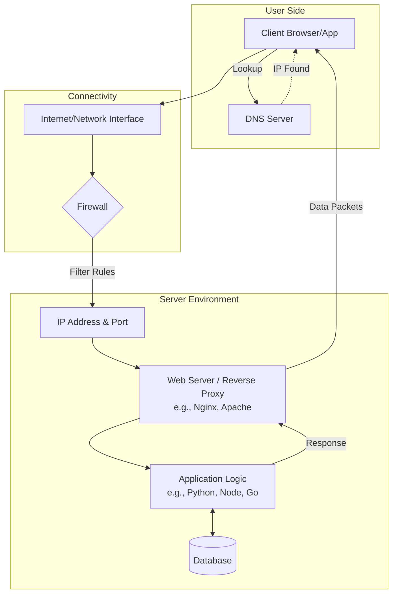

# Networking Basics (Linux for DevOps)

## 1. Introduction

**Networking** enables communication between systems, services, containers, and cloud resources.

For DevOps engineers, Linux networking knowledge is essential to:

* Debug service connectivity issues
* Expose applications safely
* Configure cloud and Kubernetes networking
* Troubleshoot production outages

Almost every production issue involves networking at some level.

## 2. Core Networking Concepts

### IP Address

* Unique identifier for a system on a network
* Can be IPv4 or IPv6

### Port

* Logical endpoint for applications
* Example: HTTP → 80, HTTPS → 443

### Protocol

* Rules for communication
* Common: TCP, UDP, ICMP

## 3. Linux Networking Flow (Mermaid Diagram)



## 4. Key Commands (Daily Use)

### Network Interfaces & IPs

```bash
ip a
ip link
```

### Open Ports & Listening Services

```bash
ss -tulnp
```

### Connectivity Testing

```bash
ping google.com
curl http://localhost
```

---

## 5. Important Files & Components

| Component         | Purpose                 |
| ----------------- | ----------------------- |
| Network Interface | Physical or virtual NIC |
| Routing Table     | Determines packet path  |
| DNS               | Name to IP resolution   |
| Firewall          | Controls traffic        |

---

## 6. Ready-to-Use Practice Scripts

### Script: Test External Connectivity

```bash
#!/bin/bash

curl -I https://example.com
```

---

### Script: Check If a Port Is Open

```bash
#!/bin/bash

ss -tulnp | grep LISTEN
```

---

## 7. Hands-on Session (Lab Tasks)

### Lab 1: Interface & IP Check

```bash
ip a
```

Tasks:

* Identify active interfaces
* Find assigned IP addresses

---

### Lab 2: Port & Service Validation

```bash
ss -tulnp
```

Tasks:

* Identify which services are listening
* Match ports to applications

---

### Lab 3: Connectivity Test

```bash
ping google.com
curl http://localhost
```

Tasks:

* Validate external connectivity
* Test local service availability

---

## 8. Common Networking Issues (Production)

* Service running but port not listening
* Firewall blocking traffic
* DNS resolution failure
* Wrong IP or port mapping

## 9. Linux Networking → Kubernetes Mapping

| Linux             | Kubernetes       |
| ----------------- | ---------------- |
| Network Interface | Node NIC         |
| IP Address        | Pod IP           |
| Port              | Container Port   |
| ss / netstat      | kubectl describe |
| localhost         | Pod namespace    |


## 10. Real-World Scenario

**Problem:**
Application running but not accessible.

**Diagnosis:**

```bash
ss -tulnp
```

**Fix:**

* Ensure service is listening
* Verify correct port
* Check firewall rules

## 11. How This Helps in DevOps

### Service Connectivity Debugging

* Identify port and protocol issues
* Validate application exposure

###  Cloud & Kubernetes Networking

* Understand NodePort, ClusterIP
* Debug pod-to-pod communication

###  CI/CD & Automation

* Health checks
* API reachability validation


## 12. DevOps One-Line Summary

> **If a service is unreachable, networking is always part of the problem.**


## 13. Interview Rapid-Fire Commands

```bash
ip a
ss -tulnp
ping
curl
```

---

### Outcome

This chapter now:

* Builds strong Linux networking fundamentals
* Prepares learners for Docker & Kubernetes networking
* Is **command-first, production-aligned, and interview-ready**
