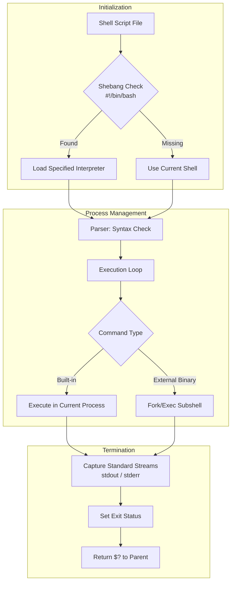

# Shell Scripting Basics (Linux for DevOps)

## 1. Introduction

**Shell scripting** allows you to automate repetitive, error-prone tasks using simple text files and Linux commands.

For DevOps engineers, shell scripts are essential for:

* CI/CD pipeline automation
* Server provisioning and maintenance
* Monitoring and alerting
* Quick production fixes

A shell script is simply a **sequence of Linux commands executed together**.

## 2. Core Concepts

###  Shell Script

* A file containing Linux commands
* Executed by a shell (bash)

###  Shebang

```bash
#!/bin/bash
```

* Tells the system which interpreter to use

## 3. Script Execution Flow



---

## 4. Key Commands (Must Know)

###  Run a Script

```bash
bash script.sh
```

or

```bash
chmod +x script.sh
./script.sh
```

---

###  Debugging & Safety Options

```bash
set -e   # Exit on error
set -x   # Print executed commands
```

---

## 5. Ready-to-Use Practice Scripts

###  Basic Script

```bash
#!/bin/bash

echo "Hello DevOps"
date
```

---

###  Safe Script Template (Production)

```bash
#!/bin/bash
set -e
set -x

echo "Script started"
date
```

---

## 6. Hands-on Session (Lab Tasks)

###  Lab 1: Backup Script

```bash
#!/bin/bash

tar -czf backup.tar.gz /etc
echo "Backup completed"
```

###  Lab 2: Cleanup Script

```bash
#!/bin/bash

find /tmp -type f -mtime +7 -delete
echo "Cleanup completed"
```

## 7. Common Mistakes (Beginner → Production)

* Missing shebang
* No execute permission
* Hardcoding paths
* No error handling


## 8. How This Helps in DevOps

###  CI/CD Automation

* Used in Jenkins, GitLab CI, GitHub Actions
* Glue between tools

###  Server Maintenance

* Automated backups
* Log cleanup
* Health checks

###  Cloud & Kubernetes

* Init scripts
* Debugging containers
* Node-level automation


## 9. Real-World Scenario

**Problem:**
Disk fills up due to old files.

**Solution:**

```bash
find /var/log -type f -mtime +30 -delete
```


## 10. DevOps One-Line Summary

> **If it’s repetitive, script it.**


## 11. Interview Rapid-Fire Commands

```bash
bash script.sh
set -e
set -x
chmod +x script.sh
```


### Outcome

This chapter now:

* Builds automation mindset
* Is CI/CD and production relevant
* Prepares learners for advanced scripting
