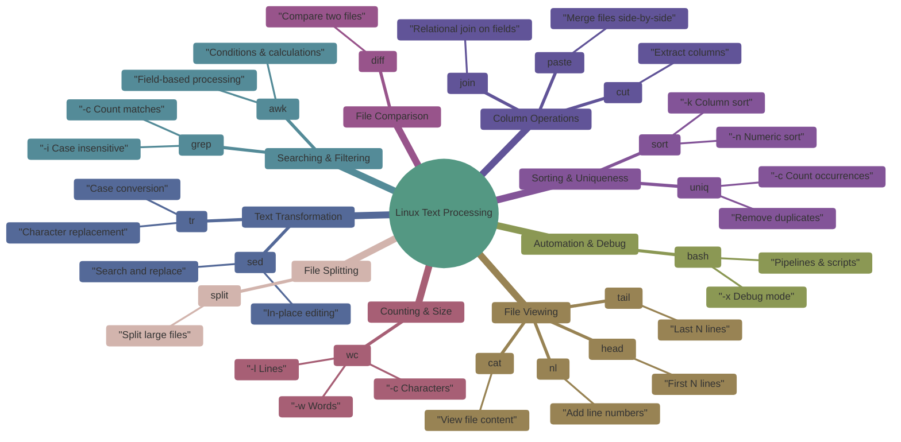

# Linux Text Processing Hands-on Lab

This hands-on lab is designed for **Linux / DevOps beginners** to practice real-world **text-processing commands** used daily while handling logs, CSV files, and reports.
---

## Flow of text processing cmd



## 1. Create the Practice File

Create a file named `employee_data.txt`:

```bash
cat <<EOF > employee_data.txt
101,John,Developer,45000,Engineering
102,Mary,Tester,40000,QA
103,Raj,Developer,47000,Engineering
104,Sneha,Manager,75000,HR
105,Ali,Developer,50000,Engineering
106,Anita,Tester,42000,QA
107,David,Manager,70000,Engineering
108,Meena,Support,35000,CustomerCare
109,Ravi,Developer,48000,Engineering
110,Tom,Tester,41000,QA
EOF
```

**File Format (CSV):**

```
ID,Name,Role,Salary,Department
```

---

##  1. View and Number the File

### `cat` – View File Content

```bash
cat employee_data.txt
```

**Use case:** Display file content

### 🔹 `nl` – Number Lines

```bash
nl employee_data.txt
```

**Important flag:**

* `nl` → adds line numbers

**Sample Output:**

```
1  101,John,Developer,45000,Engineering
2  102,Mary,Tester,40000,QA
...
```

---

## 2. Display First and Last 3 Lines

### 🔹 `head`

```bash
head -n 3 employee_data.txt
```

### 🔹 `tail`

```bash
tail -n 3 employee_data.txt
```

**Use case:** Quickly inspect large files

---

## 3. Count Lines, Words, Characters

### 🔹 `wc` – Word Count

```bash
wc employee_data.txt
```

Flags:

* `-l` → lines
* `-w` → words
* `-c` → characters

```bash
wc -l employee_data.txt
wc -w employee_data.txt
wc -c employee_data.txt
```

**Sample Output:**

```
10 employee_data.txt
```

---

## 4. Sort Data

### 🔹 Sort by Name

```bash
sort -t, -k2 employee_data.txt
```

### 🔹 Sort by Salary (Numeric)

```bash
sort -t, -k4 -n employee_data.txt
```

**Flags:**

* `-t,` → field separator
* `-k` → column number
* `-n` → numeric sort

---

## 5. Get Unique Departments

```bash
cut -d, -f5 employee_data.txt | sort | uniq
```

**Commands used:**

* `cut` → extract column
* `sort` → required before `uniq`
* `uniq` → remove duplicates

**Output:**

```
CustomerCare
Engineering
HR
QA
```

---

## 6. Find All Developers

```bash
grep -i "developer" employee_data.txt | nl
```

**Flags:**

* `-i` → case-insensitive

---

## 7. Filter High Salary (>45000)

### 🔹 `awk` – Pattern Scanning

```bash
awk -F, '$4 > 45000 {print $2, $3, $4}' employee_data.txt
```

**Explanation:**

* `-F,` → delimiter
* `$4` → salary column

**Sample Output:**

```
Raj Developer 47000
Sneha Manager 75000
Ali Developer 50000
...
```

---

## 8. Replace Text Using `sed`

```bash
sed 's/Tester/QA Engineer/g' employee_data.txt > updated.txt
```

**Flags:**

* `s` → substitute
* `g` → global replace

---

## 10. Compare Two Files

```bash
diff employee_data.txt updated.txt
```

**Use case:** Config and version comparison

---

## 11. Join Two Files

### Create Department Codes File

```bash
cat <<EOF > department_codes.txt
Engineering,ENG01
QA,QA02
HR,HR03
CustomerCare,CC04
EOF
```

### Join Files

```bash
join -t, -1 5 -2 1 <(sort -t, -k5 employee_data.txt) <(sort -t, -k1 department_codes.txt)
```

**Use case:** Database-style joins

---

## 12. Split File

```bash
split -l 3 employee_data.txt emp_part_
```

**Creates:**

```
emp_part_aa
emp_part_ab
...
```

---

## 13. Paste Files Side-by-Side

```bash
paste -d "|" employee_data.txt department_codes.txt | head -n 5
```

---

## 14. Count Developers

```bash
grep -c "Developer" employee_data.txt
```

---

## 15. Case-Insensitive Search

```bash
grep -i "manager" employee_data.txt
```

---

## 16. Unique Sorted Salaries

```bash
cut -d, -f4 employee_data.txt | sort -n | uniq
```

---

## 17. Save Numbered File

```bash
nl employee_data.txt > numbered_employee.txt
```

---

## 18. Trim Extra Spaces

```bash
tr -s ' ' < employee_data.txt | head -n 3
```

---

## 19. Extract Columns

```bash
cut -d, -f1,2,4 employee_data.txt > id_name_salary.txt
```

---

## 20. Count Employees per Department

```bash
cut -d, -f5 employee_data.txt | sort | uniq -c
```

**Output:**

```
1 CustomerCare
4 Engineering
1 HR
3 QA
```

---

## Debugging & Automation

```bash
bash -x script.sh
```

Pause execution:

```bash
read -p "Press Enter to continue"
```

---

## Real-World Practice

Replace file with logs:

```bash
grep "error" /var/log/syslog | tee errors.log
```
