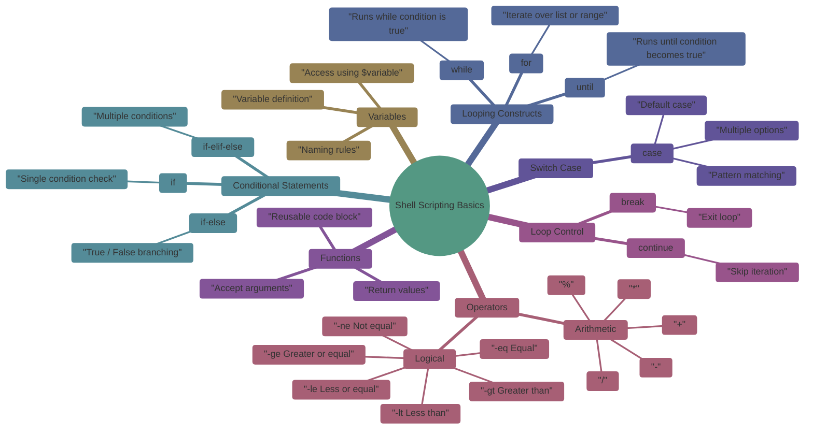

# Linux Shell Scripting Logics

This document introduces **core shell scripting concepts** required for Linux, DevOps, and automation roles. Each section explains the concept, syntax, examples, and expected output.

---


## 1. Variables in Shell Script

### What is a Variable?

A variable stores data that can be reused in a script.

### Syntax

```bash
variable_name=value
```

Rules:

* No spaces around `=`
* Variable names are case-sensitive

### Example

```bash
name="John"
age=25
echo "Name: $name"
echo "Age: $age"
```

Output:

```
Name: John
Age: 25
```

---

## 2. Arithmetic Operators

Arithmetic operations are done using `expr`, `(( ))`, or `let`.

### Operators

| Operator | Meaning        |
| -------- | -------------- |
| +        | Addition       |
| -        | Subtraction    |
| *        | Multiplication |
| /        | Division       |
| %        | Modulus        |

### Example using (( ))

```bash
a=10
b=3
echo $((a + b))
echo $((a - b))
echo $((a * b))
echo $((a / b))
echo $((a % b))
```

Output:

```
13
7
30
3
1
```

---

## 3. Logical Operators

Used in conditions.

| Operator | Meaning          |
| -------- | ---------------- |
| -eq      | equal            |
| -ne      | not equal        |
| -gt      | greater than     |
| -lt      | less than        |
| -ge      | greater or equal |
| -le      | less or equal    |

### Example

```bash
a=10
b=20
if [ $a -lt $b ]; then
  echo "a is less than b"
fi
```

Output:

```
a is less than b
```

---

## 4. If Statement

### Syntax

```bash
if [ condition ]; then
  commands
fi
```

### Example

```bash
num=5
if [ $num -gt 0 ]; then
  echo "Positive number"
fi
```

Output:

```
Positive number
```

---

## 5. If Else Statement

### Syntax

```bash
if [ condition ]; then
  commands
else
  commands
fi
```

### Example

```bash
num=-3
if [ $num -gt 0 ]; then
  echo "Positive"
else
  echo "Negative"
fi
```

Output:

```
Negative
```

---

## 6. If Elif Else Statement

### Example

```bash
marks=75
if [ $marks -ge 90 ]; then
  echo "Grade A"
elif [ $marks -ge 60 ]; then
  echo "Grade B"
else
  echo "Grade C"
fi
```

Output:

```
Grade B
```

---

## 7. While Loop

### Syntax

```bash
while [ condition ]; do
  commands
done
```

### Example

```bash
i=1
while [ $i -le 3 ]; do
  echo $i
  i=$((i+1))
done
```

Output:

```
1
2
3
```

---

## 8. Until Loop (Do While Equivalent)

Runs until condition becomes true.

### Syntax

```bash
until [ condition ]; do
  commands
done
```

### Example

```bash
i=1
until [ $i -gt 3 ]; do
  echo $i
  i=$((i+1))
done
```

Output:

```
1
2
3
```

---

## 9. For Loop

### Syntax

```bash
for var in list; do
  commands
done
```

### Example

```bash
for i in 1 2 3; do
  echo $i
done
```

Output:

```
1
2
3
```

---

## 10. Switch Case Statement

### Syntax

```bash
case $variable in
  pattern1)
    commands;;
  pattern2)
    commands;;
  *)
    default commands;;
esac
```

### Example

```bash
day=2
case $day in
  1) echo "Monday";;
  2) echo "Tuesday";;
  3) echo "Wednesday";;
  *) echo "Invalid";;
esac
```

Output:

```
Tuesday
```

---

## 11. Functions

### What is a Function?

A reusable block of code.

### Syntax

```bash
function_name() {
  commands
}
```

### Example

```bash
greet() {
  echo "Hello $1"
}

greet John
```

Output:

```
Hello John
```

---

## 12. Break Statement

Stops loop execution.

### Example

```bash
for i in 1 2 3 4; do
  if [ $i -eq 3 ]; then
    break
  fi
  echo $i
done
```

Output:

```
1
2
```

---

## 13. Continue Statement

Skips current iteration.

### Example

```bash
for i in 1 2 3; do
  if [ $i -eq 2 ]; then
    continue
  fi
  echo $i
done
```

Output:

```
1
3
```

---

## Summary

This file covered:

* Variables
* Arithmetic and logical operators
* Conditional statements
* Loops
* Switch case
* Functions
* Break and continue

This foundation is essential for shell scripting, automation, CI/CD pipelines, and DevOps workflows.
