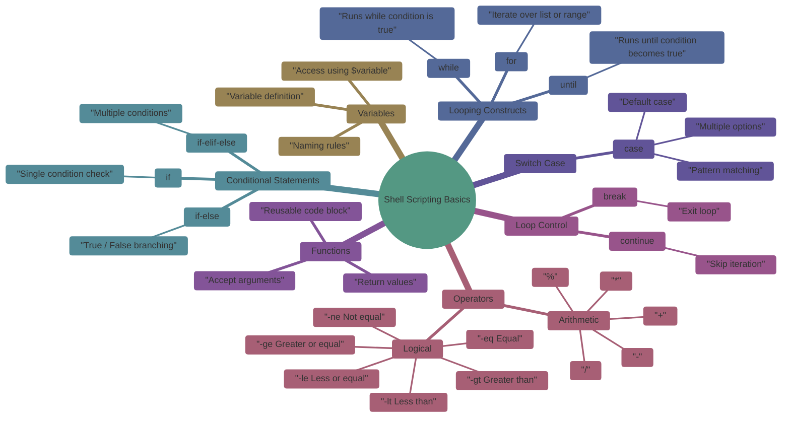

# Linux Shell Scripting Logics

This document introduces **core shell scripting concepts** required for Linux, DevOps, and automation roles. Each section explains the concept, syntax, examples, and expected output.

---


## 1. Variables in Shell Script

### What is a Variable?

A variable stores data that can be reused in a script.

### Syntax

```bash
variable_name=value
```

Rules:

* No spaces around `=`
* Variable names are case-sensitive

### Example

```bash
name="John"
age=25
echo "Name: $name"
echo "Age: $age"
```

Output:

```
Name: John
Age: 25
```

---

### Arrays in Shell Script

An **array** allows you to store **multiple values** in a single variable.

### Array Syntax

```bash
array_name=(value1 value2 value3)
```

Rules:

* Values are space-separated
* Index starts from `0`

### Example

```bash
colors=(red green blue)
echo "First color: ${colors[0]}"
echo "Second color: ${colors[1]}"
echo "All colors: ${colors[@]}"
```

Output:

```
First color: red
Second color: green
All colors: red green blue
```

### Adding Elements to an Array

```bash
colors+=(yellow)
echo "${colors[@]}"
```

### Array Length

```bash
echo "Number of colors: ${#colors[@]}"
```

---

#### Practice Script
```
#!/bin/bash

# =========================
# CREATE (Initialize Array)
# =========================
fruits=("Apple" "Banana" "Cherry")

echo "Initial array:"
echo "${fruits[@]}"
echo "-------------------------"

# =========================
# READ Operations
# =========================

# Read all elements
echo "All fruits: ${fruits[@]}"

# Read single element
echo "First fruit: ${fruits[0]}"

# Read array length
echo "Number of fruits: ${#fruits[@]}"

# Read indices
echo "Indices: ${!fruits[@]}"
echo "-------------------------"

# =========================
# UPDATE Operations
# =========================

# Update an element
fruits[1]="Mango"
echo "After updating index 1:"
echo "${fruits[@]}"

# Add new element (append)
fruits+=("Orange")
echo "After adding Orange:"
echo "${fruits[@]}"
echo "-------------------------"

# =========================
# DELETE Operations
# =========================

# Delete an element
unset fruits[2]
echo "After deleting index 2:"
echo "${fruits[@]}"

# Delete entire array
# unset fruits
# echo "Array deleted"
echo "-------------------------"

# =========================
# LOOPING THROUGH ARRAY
# =========================

echo "Looping through array:"
for fruit in "${fruits[@]}"; do
    echo "$fruit"
done

echo "-------------------------"

# =========================
# SEARCH IN ARRAY
# =========================

search="Mango"
found=false

for fruit in "${fruits[@]}"; do
    if [[ "$fruit" == "$search" ]]; then
        found=true
        break
    fi
done

if $found; then
    echo "$search found in array"
else
    echo "$search not found"
fi

echo "-------------------------"

# =========================
# SLICE ARRAY
# =========================

echo "Slice (first 2 elements):"
echo "${fruits[@]:0:2}"

echo "-------------------------"

# =========================
# COPY ARRAY
# =========================

new_fruits=("${fruits[@]}")
echo "Copied array:"
echo "${new_fruits[@]}"
```
## Variable Scope 

**Scope** defines **where a variable is accessible**.

In shell scripting, variables can be:

* a. Local variables
* b. Global variables
* c. Exported variables
* d. Environment variables


## a. Local Variables

### Definition

A **local variable** exists **only inside a function**.
* Accessible **only inside the function**
* Prevents variable name conflicts
* Used for temporary values

### Syntax

```bash
local variable_name=value
```

### Example

```bash
my_function() {
  local city="Delhi"
  echo "Inside function: $city"
}

my_function
echo "Outside function: $city"
```

### Output

```
Inside function: Delhi
Outside function:
```

---

## b. Global Variables

### Definition

A **global variable** is accessible **throughout the script**.
* Defined outside functions
* Accessible everywhere in the script
* Not automatically available to child processes

### Example

```bash
country="India"

show_country() {
  echo "Inside function: $country"
}

show_country
echo "Outside function: $country"
```

### Output

```
Inside function: India
Outside function: India
```
---

## c. Exported Variables

### Definition

An **exported variable** is a global variable that is passed to **child processes**.
* Required when child scripts need access
* Common in automation and CI/CD
* Still belongs to the current shell

### Syntax

```bash
export variable_name=value
```

### Example

```bash
export project="DevOps"

bash -c 'echo "Project: $project"'
```

### Output

```
Project: DevOps
```

### Without Export

```bash
project="DevOps"
bash -c 'echo "Project: $project"'
```

Output:

```
Project:
```

---

## d. Environment Variables

### Definition

**Environment variables** are system-wide variables available to all processes.
* Used by OS and applications
* Available to all child processes
* Crucial for DevOps tools (Java, Docker, Kubernetes)

### Common Examples

```bash
PATH
HOME
USER
SHELL
```

### View Environment Variables

```bash
env
```

or

```bash
printenv
```

### Example

```bash
echo "$PATH"
```

### Set Temporary Environment Variable

```bash
export JAVA_HOME=/usr/lib/jvm/java-17
```

### Persistent Environment Variable

Add to:

```bash
~/.bashrc
~/.bash_profile
/etc/environment
```
---

### Command Substitution (`$(command)`)

**Command substitution** allows you to **capture the output of a command** and use it as a value inside a script.

### Syntax

```bash
$(command)
```

### Example

```bash
current_date=$(date)
echo "Today is: $current_date"
```

Output:

```
Today is: Mon Jan 8 10:30:00 IST 2026
```

### Common Use Cases

```bash
files_count=$(ls | wc -l)
echo "Total files: $files_count"
```
---

## 2. Arithmetic Operators

Arithmetic operations are done using `expr`, `(( ))`, or `let`.

### Operators

| Operator | Meaning        |
| -------- | -------------- |
| +        | Addition       |
| -        | Subtraction    |
| *        | Multiplication |
| /        | Division       |
| %        | Modulus        |

### Example using (( ))

```bash
a=10
b=3
echo $((a + b))
echo $((a - b))
echo $((a * b))
echo $((a / b))
echo $((a % b))
```

Output:

```
13
7
30
3
1
```

---

# 3. Logical Operators

Used in conditions.

### Numeric Comparison Operators

| Operator | Meaning          |
| -------- | ---------------- |
| -eq      | equal            |
| -ne      | not equal        |
| -gt      | greater than     |
| -lt      | less than        |
| -ge      | greater or equal |
| -le      | less or equal    |

### Numeric Example

```bash
a=10
b=20
if [ $a -lt $b ]; then
  echo "a is less than b"
fi
```

Output:

```
a is less than b
```

---

### String Comparison Operators

| Operator | Meaning             |
| -------- | ------------------- |
| =        | equal               |
| !=       | not equal           |
| -z       | string is empty     |
| -n       | string is not empty |

### String Example

```bash
name="John"
if [ "$name" = "John" ]; then
  echo "Name is John"
fi
```

Output:

```
Name is John
```

### Empty String Check Example

```bash
city=""
if [ -z "$city" ]; then
  echo "City is empty"
fi
```

Output:

```
City is empty
```

## 4. If Statement

### Syntax

```bash
if [ condition ]; then
  commands
fi
```

### Test Command Variants (`[ ]` vs `[[ ]]`)

Both `[ ]` and `[[ ]]` are used to **test conditions** in shell scripts, but they differ in behavior and features.

---

## `[ ]` (POSIX Test Command)

* Traditional and **POSIX-compliant**
* Works in all shells (`sh`, `bash`, `dash`)
* Requires **careful quoting**
* Limited feature set

### Syntax

```bash
[ condition ]
```

### Examples

```bash
a=10
b=20

if [ $a -lt $b ]; then
  echo "a is less than b"
fi
```

### String Comparison

```bash
name="John"
if [ "$name" = "John" ]; then
  echo "Name matched"
fi
```

### Common Pitfall

```bash
# Can break if variable is empty
if [ $name = John ]; then
  echo "Error possible"
fi
```

---

## `[[ ]]` (Extended Test – Bash Only)

* **Bash-specific** (not POSIX)
* Safer and more powerful
* No word splitting or glob expansion
* Supports **regex** and **logical operators**

### Syntax

```bash
[[ condition ]]
```

### Examples

```bash
a=10
b=20

if [[ $a -lt $b ]]; then
  echo "a is less than b"
fi
```

### String Comparison (No Quotes Required)

```bash
name=John
if [[ $name == John ]]; then
  echo "Name matched"
fi
```

### Pattern Matching

```bash
file="logfile.log"

if [[ $file == *.log ]]; then
  echo "Log file"
fi
```

### Regex Matching

```bash
email="user@example.com"

if [[ $email =~ ^[a-z]+@[a-z]+\.[a-z]+$ ]]; then
  echo "Valid email"
fi
```
---

## 5. If Else Statement

### Syntax

```bash
if [ condition ]; then
  commands
else
  commands
fi
```

### Example

```bash
num=-3
if [ $num -gt 0 ]; then
  echo "Positive"
else
  echo "Negative"
fi
```

Output:

```
Negative
```

---

## 6. If Elif Else Statement

### Example

```bash
marks=75
if [ $marks -ge 90 ]; then
  echo "Grade A"
elif [ $marks -ge 60 ]; then
  echo "Grade B"
else
  echo "Grade C"
fi
```

Output:

```
Grade B
```

---

## 7. While Loop

### Syntax

```bash
while [ condition ]; do
  commands
done
```

### Example

```bash
i=1
while [ $i -le 3 ]; do
  echo $i
  i=$((i+1))
done
```

Output:

```
1
2
3
```

---

## 8. Until Loop (Do While Equivalent)

Runs until condition becomes true.

### Syntax

```bash
until [ condition ]; do
  commands
done
```

### Example

```bash
i=1
until [ $i -gt 3 ]; do
  echo $i
  i=$((i+1))
done
```

Output:

```
1
2
3
```

---

## 9. For Loop

### Syntax

```bash
for var in list; do
  commands
done
```

### Example

```bash
for i in 1 2 3; do
  echo $i
done
```

Output:

```
1
2
3
```

---

## 10. Switch Case Statement

### Syntax

```bash
case $variable in
  pattern1)
    commands;;
  pattern2)
    commands;;
  *)
    default commands;;
esac
```

### Example

```bash
day=2
case $day in
  1) echo "Monday";;
  2) echo "Tuesday";;
  3) echo "Wednesday";;
  *) echo "Invalid";;
esac
```

Output:

```
Tuesday
```

---

## 11. Functions

### What is a Function?

A reusable block of code.

### Syntax

```bash
function_name() {
  commands
}
```

### Example

```bash
greet() {
  echo "Hello $1"
}

greet John
```

Output:

```
Hello John
```

---

## 12. Break Statement

Stops loop execution.

### Example

```bash
for i in 1 2 3 4; do
  if [ $i -eq 3 ]; then
    break
  fi
  echo $i
done
```

Output:

```
1
2
```

---

## 13. Continue Statement

Skips current iteration.

### Example

```bash
for i in 1 2 3; do
  if [ $i -eq 2 ]; then
    continue
  fi
  echo $i
done
```

Output:

```
1
3
```

---

## Summary

This file covered:

* Variables
* Arithmetic and logical operators
* Conditional statements
* Loops
* Switch case
* Functions
* Break and continue

This foundation is essential for shell scripting, automation, CI/CD pipelines, and DevOps workflows.
