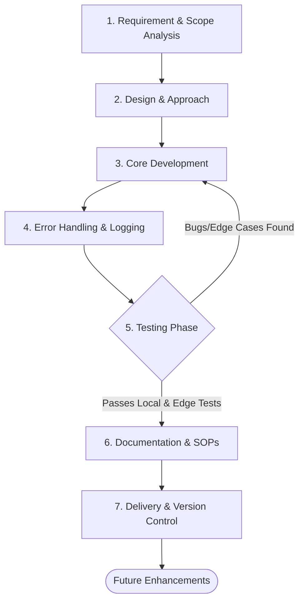

# Standard Operating Procedure (SOP): Bash & Python Scripting Workflow

## Overview
This document outlines the standard operating procedure and mental model required for developing, testing, and delivering production-grade scripts in Bash and Python. It is designed to ensure that all code is robust, maintainable, and built with a clear understanding of its root purpose. 

When onboarding new team members or freshers, this SOP serves as the baseline for how we approach automation and scripting.

---

## 1. The Mental Model: Think Before You Code

Writing a script is not just about solving the immediate problem; it is about building a sustainable tool. Approach every requirement with the following mindset:

1. **The Root Purpose:** What is the actual problem? (e.g., Are we just parsing logs, or are we building an alerting mechanism that sends notifications to Slack?) Understand the "why" before the "how."

2. **The "Blast Radius":** What happens if the script fails midway? Will it leave zombie processes behind? Will it corrupt a database (like MongoDB)? Always design scripts to fail gracefully and safely.

3. **Idempotency:** A script should be safe to run multiple times. If it creates a resource, it should first check if that resource already exists.

4. **Future-Proofing (Scalability):** Hardcoding limits your script's lifespan. Write functions and modularize code so that adding a new feature tomorrow requires changing a parameter, not rewriting the core logic.

---

## 2. Workflow Architecture

The following flow represents the lifecycle of a scripting task from conception to delivery.

---

## 3. Step-by-Step Development Phases

### Phase 1: Requirement & Architecture

* **Define Inputs/Outputs:** 

    Clarify what the script takes in (flags, environment variables, JSON payloads) and what it spits out (STDOUT, a file, an API call).

* **Choose the Right Tool:** 

     Use **Bash** for simple system-level tasks, file manipulation, and chaining CLI commands.

* Use **Python** for complex data structures, API interactions, extensive string manipulation, and heavy logical processing.

### Phase 2: Core Development

* **Environment Isolation:** 
    
    Use Virtual Environments (`venv`) for Python to manage dependencies.

* **Configuration Management:** 
    
    Never hardcode secrets, API keys, or database URIs. Fetch them from environment variables or a secure vault.
* **Modularity:** 

    Break down monolithic code blocks into single-responsibility functions.
* **Standard Formatting:** 

    Follow `PEP 8` for Python. Use ShellCheck for Bash.

### Phase 3: Error Handling & Logging

* **Verbose Execution:** 

    Implement dry-run modes (`--dry-run`) whenever destructive actions are involved.

* **Meaningful Exits:** 

    Use standard exit codes (`exit 0` for success, `exit 1` for general errors) so orchestration tools can interpret the script's result.

* **Logging:** 

    Avoid just using `print()` or `echo`. Implement proper logging levels (INFO, WARN, ERROR, DEBUG) with timestamps.

### Phase 4: Testing & Bug Checking

* **Happy Path Testing:** 

    Verify the script achieves its primary goal under ideal conditions.
* **Edge Case/Chaos Testing:** 

    * What if the network drops?
    * What if the input file is empty or locked?
    * What if the required permissions are missing?

* **Unit Testing:** 

    For Python, write `pytest` modules for critical logical functions. For Bash, use `BATS` (Bash Automated Testing System).

### Phase 5: Documentation & Delivery

* **Inline Comments:** 

    Explain the *why*, not the *what*. (The code already shows what it's doing).

* **`--help` Flag:** 

    Every script must have a `-h` or `--help` flag detailing usage, arguments, and examples.

* **README Integration:** 

    Update the repository documentation to explain how to invoke the script, required prerequisites, and expected outputs.

---

## 4. Checklist for Peer Review (PR / Delivery)

Before submitting the code for review, ensure the following criteria are met:

* [ ] Does the script begin with a proper Shebang (`#!/usr/bin/env bash` or `#!/usr/bin/env python3`) ?

* [ ] Are all variables appropriately scoped (e.g., using `local` in Bash functions) 

* [ ] Are external dependencies listed (e.g., `requirements.txt` for Python) ?

* [ ] Is input validation strictly enforced ?

* [ ] Are typos and naming conventions corrected (e.g., ensuring technical terms like MongoDB are spelled accurately in logs/docs) ?

* [ ] Have potential future enhancements been logged as `TODO` comments or GitHub issues ?
