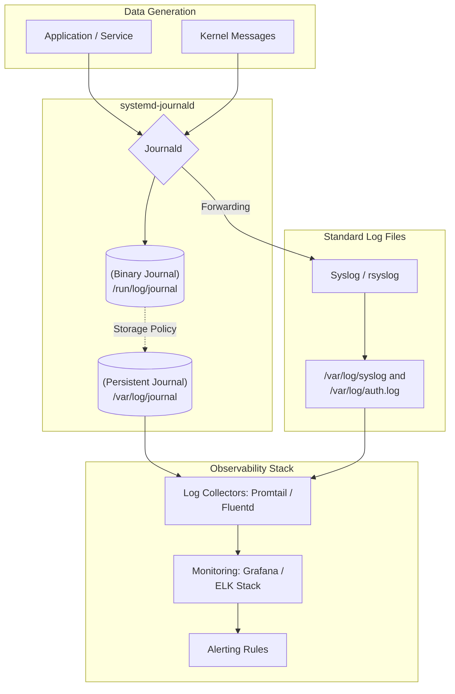

# Logs and Monitoring

## 1. Introduction

**Logs** are the primary source of truth for understanding **what happened, when it happened, and why it happened** on a Linux system.

For DevOps engineers, logs are critical for:

* Incident response
* Root cause analysis
* Service health monitoring
* Auditing and compliance

Most modern Linux systems use **systemd journal** along with traditional log files.


## 2. Core Logging Concepts

###  System Logs

* Capture OS-level events
* Service start/stop/failures

###  Application Logs

* Generated by applications
* Used for debugging and tracing issues

###  Centralized Logging

* Aggregating logs from multiple systems
* Used in production environments


## 3. Linux Logging Flow



---

## 4. Key Commands (Daily Use)

###  systemd Journal

```bash
journalctl -xe
journalctl -u nginx
```

### Traditional Log Files

```bash
tail -f /var/log/syslog
tail -f /var/log/messages
```

---

## 5. Important Log Locations

| Path                | Purpose             |
| ------------------- | ------------------- |
| `/var/log/syslog`   | General system logs |
| `/var/log/auth.log` | Authentication      |
| `/var/log/nginx/`   | Nginx logs          |
| `journalctl`        | systemd logs        |

---

## 6. Ready-to-Use Practice Scripts

###  Script: View Recent Logs

```bash
#!/bin/bash

tail -n 20 /var/log/syslog
```

---

###  Script: Monitor a Service Log

```bash
#!/bin/bash

journalctl -u nginx -f
```

---

## 7. Hands-on Session (Lab Tasks)

###  Lab 1: Analyze System Logs

```bash
journalctl -xe
```

Tasks:

* Identify errors
* Trace recent failures

---

###  Lab 2: Monitor Service Logs

```bash
journalctl -u nginx
```

Tasks:

* Stop service
* Start service
* Observe log entries

---

## 8. Common Logging Issues (Production)

* Logs rotated too frequently
* Disk full due to excessive logs
* No monitoring or alerts
* Logs not centralized

---

## 9. Logs → Monitoring → Alerts (DevOps Flow)

```text
Logs generated
→ Logs collected
→ Metrics derived
→ Alerts triggered
→ Incident response
```

---

## 10. Real-World Scenario

**Problem:**
Service fails to start.

**Diagnosis:**

```bash
journalctl -u nginx
```

**Fix:**

* Identify error message
* Correct configuration
* Restart service


## 11. How This Helps in DevOps

###  Incident Response

* Faster debugging
* Reduced downtime

### Root Cause Analysis

* Trace failures back to origin
* Correlate system and app logs

### Kubernetes & Cloud

* Node logs
* Pod logs (`kubectl logs`)
* Centralized log stacks


## 12. DevOps One-Line Summary

> **No logs = no visibility. No visibility = longer outages.**

---

## 13. Interview Rapid-Fire Commands

```bash
journalctl -xe
journalctl -u nginx
tail -f /var/log/syslog
```

---

### Outcome

This chapter now:

* Builds strong troubleshooting mindset
* Prepares learners for production incidents
* Aligns Linux skills with cloud & Kubernetes observability
