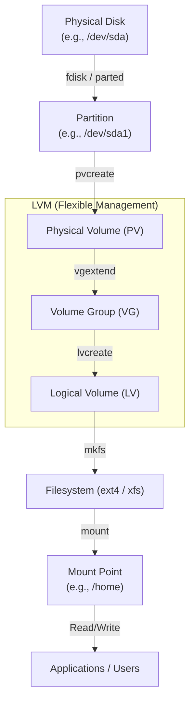
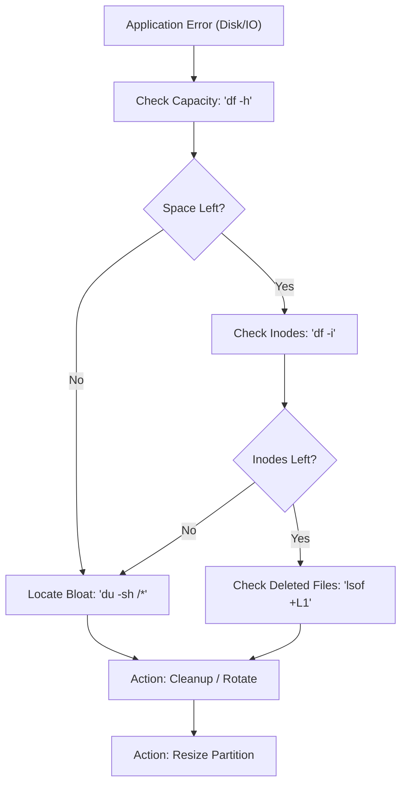

# Storage and Disk Management (Linux)

## 1. Introduction

Storage and Disk Management in Linux deals with how disks are **partitioned, formatted, mounted, monitored, and maintained**.

In real systems:

* A **full disk can crash applications**
* A **wrong mount can cause data loss**
* **Uncontrolled log growth** can bring down servers

Understanding storage is **mandatory** for system administrators and DevOps engineers.


## 2. Storage Architecture (Linux View)

This flowchart depicts the standard Linux storage architecture. It demonstrates how physical hardware is abstracted through LVM (Physical Volumes, Volume Groups, and Logical Volumes) to provide flexible, resizable storage that is ultimately formatted and mounted for application use.

**Key Stages of the Flow:**
Hardware Layer: Raw storage (Disk) is divided into smaller segments (Partitions).

* LVM Abstraction:
* PV: Initializes the partition for LVM use.
* VG: Combines multiple Physical Volumes into a single "pool" of storage.
* LV: Carves out virtual partitions from the pool that can be easily resized.
* Software Layer: The Logical Volume is formatted with a Filesystem (like ext4 or xfs).
* User Space: The filesystem is attached to the Linux directory tree at a Mount Point, allowing Applications to perform read/write operations.





## 3. Core Concepts

| Term       | Description                      |
| ---------- | -------------------------------- |
| Disk       | Physical or virtual block device |
| Partition  | Logical division of a disk       |
| Filesystem | Structure for storing files      |
| Mount      | Attach filesystem to directory   |
| Inode      | Metadata of files                |
| Block      | Smallest unit of disk storage    |


## 4. Common Filesystem Types

| Filesystem | Usage                    |
| ---------- | ------------------------ |
| ext4       | Default Linux filesystem |
| xfs        | High-performance systems |
| tmpfs      | In-memory filesystem     |
| nfs        | Network filesystem       |


## 5. Essential Disk Commands

###  Check Disk Space

```bash
df -h
```

###  Check Disk Usage by Directory

```bash
du -sh *
```

###  List Disks and Partitions

```bash
lsblk
```

###  Show Mounted Filesystems

```bash
mount
```

###  Filesystem Type

```bash
df -Th
```

## 6. Important Directories (Storage Perspective)

| Directory | Purpose               |
| --------- | --------------------- |
| `/`       | Root filesystem       |
| `/var`    | Logs, cache, spool    |
| `/home`   | User data             |
| `/tmp`    | Temporary files       |
| `/mnt`    | Temporary mount point |
| `/media`  | External devices      |


## 7. Disk Usage Analysis Flow



## 8. Ready-to-Use Practice Scripts

###  Disk Space Report

```bash
#!/bin/bash
df -h
```

###  Find Top Space-Consuming Directories

```bash
#!/bin/bash
du -sh /* | sort -h
```


## 9. Hands-on Labs

###  Lab 1: Identify Disk Pressure

```bash
df -h
df -i
```


###  Lab 2: Find Large Files

```bash
du -sh /var/*
```


## 10. Inode Management (Often Ignored)

### Check Inode Usage

```bash
df -i
```

> Disk can show free space but still fail due to **inode exhaustion**


## 11. Mounting & Persistent Mounts

### Temporary Mount

```bash
mount /dev/sdb1 /mnt
```

### Persistent Mount (`/etc/fstab`)

```ini
/dev/sdb1   /data   ext4   defaults   0 2
```

### Validate fstab Safely

```bash
mount -a
```

## 12. Common Production Issues

| Issue                | Command |
| -------------------- | ------- |
| Disk full            | `df -h` |
| Too many small files | `df -i` |
| Volume not mounted   | `lsblk` |
| App cannot write     | `mount` |


## 13. Log Growth & Cleanup (Linux)

### Identify Large Logs

```bash
du -sh /var/log/*
```

### Truncate Logs Safely

```bash
truncate -s 0 /var/log/syslog
```

> Never delete logs blindly in production


## 14. Best Practices (Real-World)

* Separate OS and data disks
* Monitor disk & inode usage
* Rotate logs
* Avoid storing data on `/`
* Always verify mounts after reboot

---

## 15. DevOps & SysAdmin Relevance

* Prevent outages caused by disk issues
* Faster root cause analysis
* Safer system operations
* Better capacity planning

---

## 16. Interview Rapid-Fire Commands

```bash
df -h
df -i
du -sh *
lsblk
mount
```


## 17. One-Line Summary

**Most production outages start with storage negligence.**
> CPU spikes slow apps.

> Memory leaks crash apps.

> Disk full kills apps.
