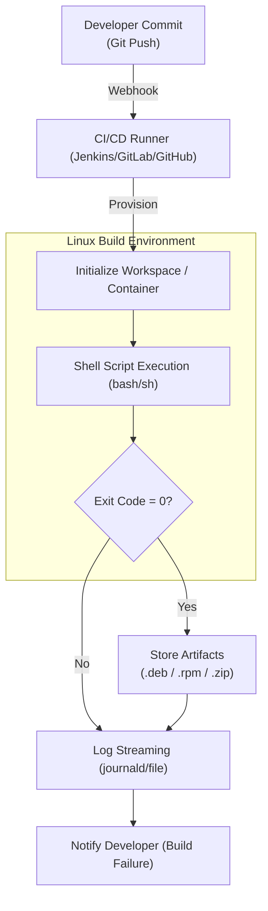
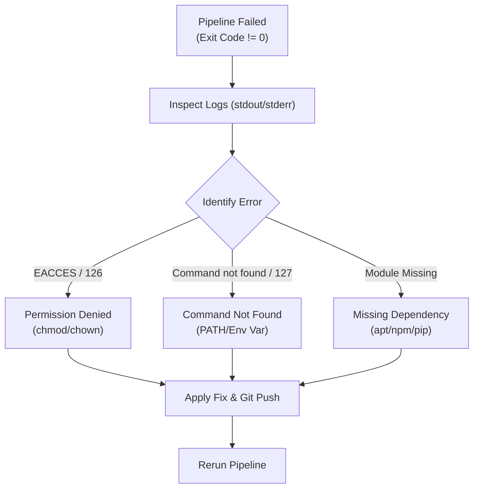

# Linux for CI/CD and Cloud

## 1. Introduction

Linux is the **execution layer** of modern CI/CD pipelines and cloud infrastructure.
Almost every build agent, deployment server, runner, and automation node runs on Linux.

In real environments, Linux is responsible for:

* Running pipeline jobs
* Secure server access
* Automating tasks
* Scheduling builds and cleanups
* Managing credentials and permissions


## 2. CI/CD Execution Flow (Linux View)




## 3. Core Linux Concepts Used in CI/CD

| Concept             | Usage                   |
| ------------------- | ----------------------- |
| SSH                 | Secure remote execution |
| Shell scripts       | Job automation          |
| Cron                | Scheduled jobs          |
| Users & permissions | Secure pipelines        |
| Logs                | Debug failed jobs       |


## 4. Essential Commands (Must-Know)

###  Remote Access (SSH)

```bash
ssh user@server
```

###  Secure File Transfer

```bash
scp file user@server:/path
```

###  Job Scheduling

```bash
crontab -e
crontab -l
```


## 5. SSH Automation (CI/CD Friendly)

### Passwordless SSH Setup

```bash
ssh-keygen
ssh-copy-id user@server
```

### Test Connectivity

```bash
ssh user@server "hostname"
```

> Passwordless SSH is **mandatory** for automation


## 6. Shell Scripting for CI/CD Jobs

### Simple CI Job Script

```bash
#!/bin/bash
set -e

echo "Starting CI job"
date
echo "Job completed"
```

### Make Script Executable

```bash
chmod +x job.sh
```


## 7. Cron Jobs in CI/CD & Cloud

### View Existing Cron Jobs

```bash
crontab -l
```

### Example: Nightly Cleanup Job

```bash
0 2 * * * /opt/scripts/cleanup.sh
```

| Field | Meaning |
| ----- | ------- |
| 0     | Minute  |
| 2     | Hour    |
| *     | Day     |
| *     | Month   |
| *     | Weekday |


## 8. Hands-on Labs

###  Lab 1: SSH Automation

```bash
ssh user@server "uptime"
```


###  Lab 2: Schedule a Job

```bash
crontab -e
```

Add:

```bash
*/5 * * * * echo "CI heartbeat" >> /tmp/ci.log
```

## 9. Logs in CI/CD Systems

### View Job Logs

```bash
cat /var/log/syslog
```

### Debug Script Failures

```bash
bash -x job.sh
```

## 10. Permissions & Security (Critical)

### Avoid Running Jobs as root

```bash
whoami
```

### Grant Limited Access

```bash
usermod -aG sudo cicduser
```

> Principle of least privilege applies to pipelines too


## 11. Common Production Issues

| Issue             | Command              |
| ----------------- | -------------------- |
| SSH fails         | `ssh -v user@server` |
| Script fails      | `bash -x script.sh`  |
| Cron not running  | `journalctl -u cron` |
| Permission denied | `ls -l`              |


## 12. CI/CD Failure Debug Flow



## 13. Best Practices (Linux Side)

* Use non-root users
* Enable passwordless SSH
* Log every job
* Use `set -e` in scripts
* Clean old artifacts automatically


## 14. How This Helps in DevOps

* Reliable pipeline execution
* Secure cloud automation
* Faster troubleshooting
* Stable build & deploy environments


## 15. Interview Rapid-Fire Commands

```bash
ssh user@server
scp file user@server:/path
crontab -l
bash -x script.sh
chmod +x script.sh
```

## 16. One-Line Summary

> **CI/CD tools orchestrate pipelines,
> Linux executes them reliably.**
